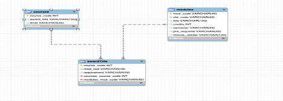

# UN-Course-Design-DB-Optimization

## Project Introduction

Welcome to the "UN-Course-Design-DB-Optimization" project repository! This initiative stems from the need to enhance the academic management system at the University of Northampton England by leveraging modern database practices. The project revolves around a carefully curated dataset containing information on newly developed computing courses.

## Problem Statement:

In the landscape of academic course management at the University of Northampton, there exists a critical need for a more optimized and streamlined database system. The current state, characterized by disparate datasets and less-than-ideal data structures, poses challenges in efficiently managing and extracting meaningful insights from the information related to newly developed computing courses.

## Objective:

This project aims to address these challenges by implementing an optimized database system that aligns with best practices in data engineering. Through careful design, implementation, and documentation processes, we aim to enhance the overall management of computing courses at the University of Northampton, providing a foundation for informed decision-making and improved academic outcomes.

## Skills Demonstrated:

- Data Analysis
- Database Design
- Database Implementation
- Documentation
- Query Language Proficiency (SQL and Cypher)
- Critical Thinking
- Communication Skills
- Problem Solving
- Optimization Techniques
- Data Engineering Best Practices

## Database Implementation: 
The designed models are implemented into a relational database and a graph database, fostering an optimized and efficient data structure.

## Documentation: The project report is expected to include:

In-depth dataset analysis and the intricacies of the design process.
Presentation and justification of both relational and graphical models.
Documentation of the database creation process.

## Query Implementation: The report incorporates carefully crafted SQL and Cypher commands to address specific queries, including:

- Display those modules running in both semesters.
- Display all modules with at least a designated module.
- Which course has the most prerequisites?
- Display those modules that appear on a single course.
- Does the Computer Science course have an unbalanced workload in either semester?

